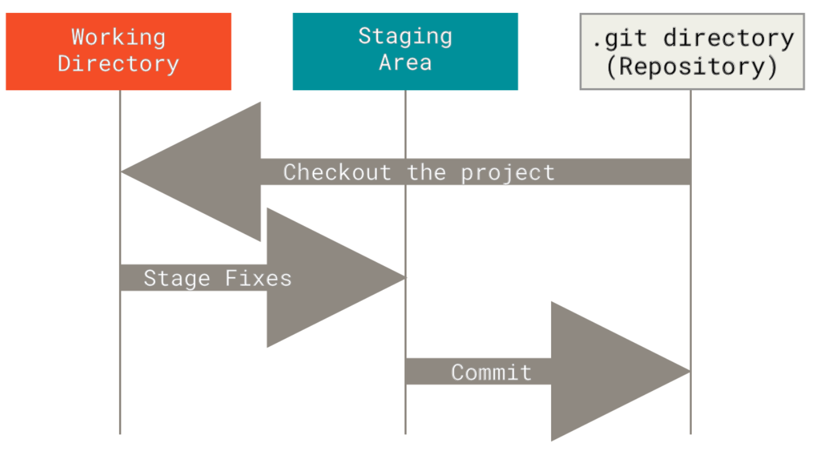
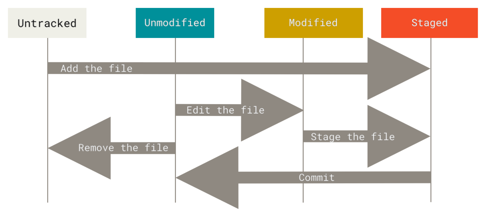
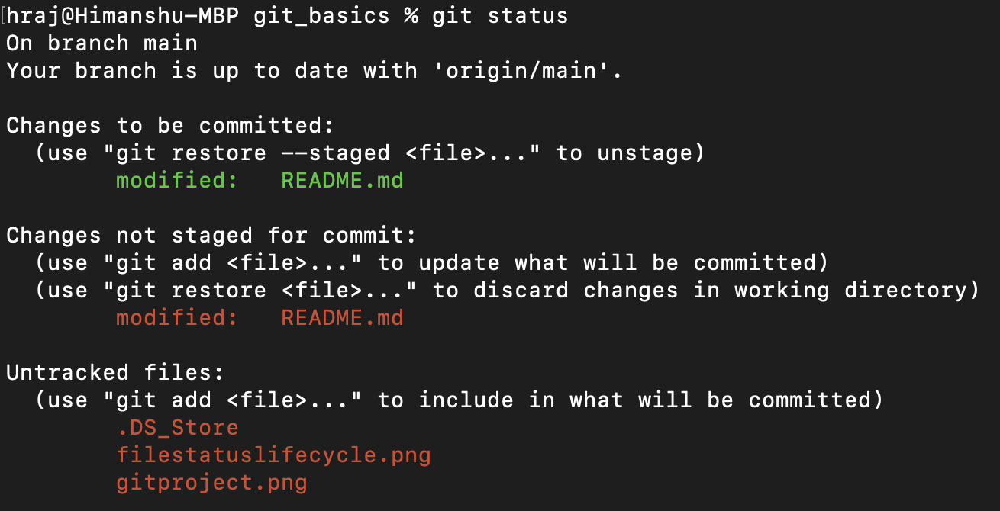
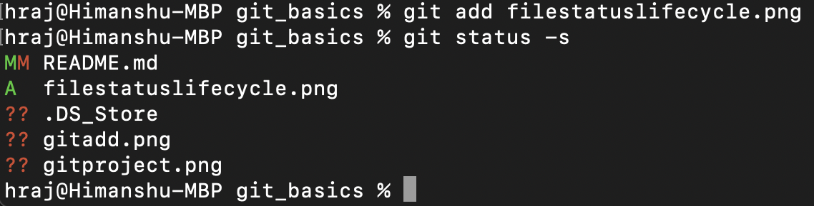

# Getting started with Git

The official [git documentation](https://git-scm.com/doc) is a good resource for learning git. In particular I found chapters 1, 2 and 3 of the book quite useful that which are more than enough for starting collaborative projects. Here I collect the main points from these chapters for quick reference.

## Background

Git is a version control system (VCS for short) that efficiently keeps keeps track of the versions or snapshots of your projects over time. 

In git, there are three main states that (tracked) files can reside in: *modified*, *staged*, and *committed*:

+ Modified means that you have changed the file but have not committed it to your database yet.
+ Staged means that you have marked a modified file in its current version to go into your next commit snapshot.
+ Committed means that the data is safely stored in your local database.

This leads us to the three main sections of a Git project: the working tree, the staging area, and the Git directory.

<figure>
    
    <figcaption class="figure-caption text-right">Figure 1: Working tree, staging area, and Git directory</figcaption>
</figure>

<!--  -->


The working tree is a single checkout (or a working copy) of one version of the project. These files are pulled out of the compressed database in the Git directory and placed on disk for you to use or modify.

The staging area is a file, generally contained in your Git directory, that stores information about what will go into your next commit.

The Git directory is where Git stores the metadata and object database for your project. This is the most important part of Git, and it is what is copied when you clone a repository from another computer.

The basic Git workflow goes something like this:
1. You modify files in your working tree.
2. You selectively stage just those changes you want to be part of your next commit, which adds
only those changes to the staging area.
3. You do a commit, which takes the files as they are in the staging area and stores that snapshot
permanently to your Git directory.

If a particular version of a file is in the Git directory, it’s considered *committed*. If it has been modified and was added to the staging area, it is *staged*. And if it was changed since it was checked out but has not been staged, it is *modified*.

## Initialization 

Need to do a few things to customize your Git environment on a new system (need to do them only once on any given computer; they’ll stick around between upgrades).

To check Git configuration settings: `git config --list`

In a new system set the user name and email address as follows

```
git config --global user.name "John Doe"
git config --global user.email johndoe@example.com
```
Git will always use that information for anything you do on that system. If you want to override this with a different name or email address for specific projects, you can run the command without the `--global` option when you’re in that project.

To get quick help for any command: `git <command> -h`

## Git Basics

The basic things to know about Git are

* Configure and initialize a repository
* Begin and stop tracking files
* Stage and commit changes
* Set up Git to ignore certain files and file patterns
* How to undo mistakes quickly and easily
* How to browse the history of your project and view changes between commits
* How to push and pull from remote repositories

### Creating a Git repository

To initialize a non-git repository (meaning currently not under version control) in an existing directory go to the directory in command line and execute 

`git init` 

This creates a new subdirectory named .git, a Git repository skeleton, that contains all of your necessary repository files. 

To make a copy of an existing git repository execute:

`git clone <repository_address> <new_repository_name>`

Here `<new_repository_name>` is optional. If not specified, the name of the directory in which the repository is cloned is the same as the original.

To start tracking the version controlling of existing files which are not under version control (for instance after initializing a non-git repository) we use

`git add <file_name>` 

followed by

`git commit -m '<commit_message>'`

### Life cycle of a file status in a Git repository

At this point we have a *bona fide* Git repository on the local machine, and a working copy of all of its files. Next, you’ll want to start making changes and committing snapshots of those changes into your repository each time the project reaches a checkpoint (a state you want to keep a record of).

Files in the working directory can be in one of two states: *tracked* or *untracked*.

Tracked files are files that were in the last snapshot, as well as any newly staged files. As previously mentioned these files can be in *modified*, *staged*, and *committed* states. Tracked files are files that Git knows about. 

Files in the working directory wich are not tracked are untracked files. These are files that were not in your last snapshot and are not in the staging area. When you first clone a repository, all of your files will be tracked and unmodified because Git just checked them out and you haven’t edited anything.

As you edit files, Git sees them as modified, because you’ve changed them since your last commit. As you work, you selectively stage these modified files and then commit all those staged changes, and the cycle repeats.

<figure>
    
    <figcaption class="figure-caption text-right">Figure 2: The lifecycle of the status of your files</figcaption>
</figure>

To see the status of *all* the files in the repository execute 

`git status`

It also displays which branch you are on and informs if the the branch has diverged from the branch on the server (the GitHub website for instance). 

### `git add`: More on staging

The `git add` command stages both
* untracked files
* modified files

`git add <file_name>` stages the version of `<file_name>` at the time of executing `git add`. Past this point in time, if you do some modification to `<file_name>` then running a `git status` will show `<file_name>` both under `Changes to be committed` and `Changes not staged for commit` sections (as shown below)
<figure>
    
</figure>

If you commit now, the version of `<file_name>` as it was when you last ran the `git add` command is how it will go into the commit, not the version of the file as it looks in your working directory when you run `git commit`. If you modify a file after you run `git add`, you have to run `git add` again to stage the latest version of the file. `git add` is a multipurpose command — you use it to begin tracking new files, to stage files, and to do other things like marking merge-conflicted files as resolved. It may be helpful to think of it more as "add precisely this content to the next commit" rather than "add this file to the project".


### `git status -s`: Short Status

`git status` output is pretty comprehensive. Instead one can use `git status -s` or `git status -short` which gives far more simplified output:

<figure>
    
</figure>

New files that aren’t tracked have a ?? next to them, new files that have been added to the staging area have an A, modified files have an M and so on. There are two columns to the output — the left- hand column indicates the status of the staging area and the right-hand column indicates the status of the working tree. For example `README.md` was modified, staged and then modified again, so there are changes to it that are both staged and unstaged.

### `.gitignore`: Ignoring Files

To prevent Git from tracking certain files (for instance automatically generated files such as log files or files produced by your build system). To do this create a `.gitignore` file

`touch .gitignore`

and add all filesname (typically matching certain patterns) into the `.gitignore` file. There are rules for the patterns that you can put in the .gitignore file (see pg 32 of the book if needed).  GitHub maintains a fairly comprehensive list of good .gitignore file examples for dozens of projects and languages at https://github.com/github/gitignore if you want a starting point for your project. 

### `git diff`: View precise staged and unstaged changes 

What have you changed but not yet staged? What have you staged that you are about to commit? Although `git status` answers those questions very generally by listing the file names, `git diff` shows you the exact lines added and removed. 

This command compares what is in your working directory with what is in your staging area. The result tells you the changes you’ve made that you haven’t yet staged. If you want to see what you’ve staged that will go into your next commit, you can use `git diff --staged`. 

### `git commit`: Committing Your Changes

Running `git commit` launches the default editor (which can be specified at the initialization process) where we need to enter the commit message for your changes. Alternatively we can run `git commit -m "<commit_message>"` and enter the commit message at command line. 

The command outputs which branch you committed to, what SHA-1 checksum the commit has, how many files were changed, and statistics about lines added and removed in the commit.

The commit records the snapshot you set up in your staging area. To skip going though the staging part use the `-a` flag

`git commit -a -m "<commit_message>"`

This makes Git automatically stage every file that is already tracked before doing the commit, letting you skip the git add part. 

### `git rm`: Removing Files

To remove a file from git repository run `git rm <file_name>` instead of `rm <file_name>`. While both commands will remove the file from your working directory the former also removes it from the staging area (i.e., remove it as a tracked file). 

### `--amend`: Amend your commits

One of the common undos takes place when you commit too early and possibly forget to add some files, or you mess up your commit message. If you want to redo that commit, make the additional changes you forgot, stage them, and commit again using the `--amend` option

`git commit --amend`

This command takes your staging area and uses it for the commit. If you’ve made no changes since your last commit (for instance, you run this command immediately after your previous commit), then your snapshot will look exactly the same, and all you’ll change is your commit message.

The same commit-message editor fires up, but it already contains the message of your previous commit. You can edit the message the same as always, but it overwrites your previous commit.

As an example, if you commit and then realize you forgot to stage the changes in a file you wanted to add to this commit, you can do something like this:

```
git commit -m 'Initial commit'
git add forgotten_file
git commit --amend
```
You end up with a single commit — the second commit replaces the results of the first. 

The obvious value to amending commits is to make minor improvements to your last commit, without cluttering your repository history with commit messages of the form, “Oops, forgot to add a file” or “Darn, fixing a typo in last commit”.

Only amend commits that are still local and have not been pushed somewhere. Amending previously pushed commits and force pushing the branch will cause problems for your collaborators.

### `git reset`: Unstaging a Staged File

you’ve changed two files and want to commit them as two separate changes, but you accidentally type git add * and stage them both. This can be done with 

`git reset HEAD <file_to_be_unstaged>`

### `git checkout -- <file>`: Unmodifying a Modified File

This reverts the file `<file>` back to what it looked like when you last committed. 

It’s important to understand that git checkout -- <file> is a dangerous command. Any local changes you made to that file are gone — Git just replaced that file with the last staged or committed version. Don’t ever use this command unless you absolutely know that you don’t want those unsaved local changes.

### Undoing things 
The command

`git restore --staged <file_to_be_unstaged>` 

can be used to to unstage staged files. It’s basically an alternative to `git reset`

The command

`git restore <file>` 

discards changes to `<file>` in working directory. It revert it back to what it looked like when you last committed. It is basically an alternative for `git checkout -- <file>`. Likewise, it is important to understand that git checkout -- <file> is a dangerous command. Any local changes you made to that file are gone — Git just replaced that file with the last staged or committed version. Don’t ever use this command unless you absolutely know that you don’t want those unsaved local changes.

We can also use `git restore` to un-commit changes. For instance, if we want to go one commit back then execute

`git reset HEAD~1`

To go back multiple commits run

`git reset <commit_hash>`
`git reset --hard <commit_hash>`

where `commit_hash` is commit hash number. This essentially rewriting history. 

### Viewing commit history

`git log --pretty=oneline`

To limit the lof output run

`git log --since=2.weeks`

To view the last commit 

`git log -1 HEAD`

## Working with Remotes

To be able to collaborate on any Git project, you need to know how to manage your remote repositories. Remote repositories are versions of your project that are hosted on the Internet like GitHub. Collaborating with others involves managing these remote repositories and pushing and pulling data to and from them when you need to share work. 

Managing remote repositories includes 

* Knowing how to add remote repositories 
* Remove remotes that are no longer valid
* Manage various remote branches and define them as being tracked or not

### `git remote`: Showing Your Remotes

If you’ve cloned your repository, running `git remote`  should at least show `origin` — that is the default name Git gives to the server you cloned from. 

`git remote -v`

This shows the URLs that Git has stored for the shortname to be used when reading and writing to that remote.  

If you have more than one remote, the command lists them all.

On the other hand if you used `git init` to locally create a Gir repository and want to attach a remote repository to it, run the following

`git remote add <alias> <url>`

### Fetching and Pulling from Your Remotes

The command

`git fetch <remote>`

goes out to that remote project and pulls down all the data from that remote project that you don’t have yet. After you do this, you should have references to all the branches from that remote, which you can merge in or inspect at any time. It fetches any new work that has been pushed to that server since you cloned (or last fetched from) it. 

It’s important to note that the git fetch command only downloads the data to your local repository — it doesn’t automatically merge it with any of your work or modify what you’re currently working on. You have to merge it manually into your work when you’re ready.

If your current branch is set up to track a remote branch, you can use the 
 
`git pull` 

command to automatically fetch and then merge that remote branch into your current branch. This command is essentially a `git fetch` immediately followed by a `git merge` (to be covered below) in most cases. This may be an easier or more comfortable workflow for you; and by default, the `git clone` command automatically sets up your local `master` branch to track the remote `master` branch (or whatever the default branch is called) on the server you cloned from.

### Pushing to Your Remotes

When you have your project at a point that you want to share, you have to push it upstream. The command for this is simple: 

`git push <remote> <branch>`

If you want to push your master branch to your origin server (again, cloning generally sets up both of those names for you automatically), then you can run `git push origin master` to push any commits you’ve done back up to the server. 

This command works only if you cloned from a server to which you have write access and if nobody has pushed in the meantime.

### Inspecting a Remote

`git remote show <remote_name>`

### Renaming and Removing Remotes

`git remote rename <from_remote_name> <to_remote_name>` 
`git remote remove <remote_name>`

### Tagging

Git has the ability to tag specific points in a repository’s history as being important. Typically, people use this functionality to mark release points (v1.0, v2.0 and so on). 

To create a tag "v1" with a tagging message run

`git tag -a v1 -m "<tagging_message>"`

To create lightweight tags do not use `-a` flag.

Run 

`git tag`

to view all the tags associated to the repository. 

`git show <tag_name>` shows all the tag data. 

You can also tag commits after you’ve moved past them. For instance you want to tag after the commit with the checksum `9fceb02d0ae598e95dc970b74767f19372d61af8` . Run

`git tag -a v1.2 9fceb02`

The commit to be tagged is specified by the checksum as shown above. 

### Sharing tags

By default, the `git push` command doesn’t transfer tags to remote servers. You will have to explicitly push tags to a shared server after you have created them.  

`git push origin <tagname>`

If you have a lot of tags that you want to push up at once, you can also use the `--tags` option to the `git push` command. This will transfer all of your tags to the remote server that are not already there.

When someone else clones or pulls from your repository, they will get all your tags as well.

### Deleting tags

`git tag -d <tagname>`

### Checking out Tags

If you want to view the versions of files a tag is pointing to, you can do 

`git checkout <tag_name>`


## Git Branching

Branching means you diverge from the main line of development and continue to do work without messing with that main line. Branching is the prime feature of Git that sets it apart from other VCS. 

Git is written in C and and most of the branching features of of Git gets it power from efficient memory handing of the C language. We refer to the book for a detailed explaination. 

To view the current branch run

`git branch`

### Creating a new branch

`git branch <new_branch_name>`

### Switching branches

`git checkout <branch_name>`

It’s typical to create a new branch and want to switch to that new branch at the same time — this can be done in one operation with 

`git checkout -b <newbranchname>`

From Git version 2.23 onwards you can use `git switch` instead of `git checkout` to: 

* Switch to an existing branch: `git switch <branch_name>`
* Create a new branch and switch to it: `git switch -c new-branch`. The `-c` flag stands for create, you can also use the full flag: `--create`
* Return to your previously checked out branch: `git switch -`

### Basic Merging (without any conflicts)

Suppose you have two branches `main` and `local` which branched out from `main` at commit `c5`. You did some work on `local` branch and made further commits to it. In order to merge the changes made in `local` into the `main` branch `switch` to `main` branch and run

`git merge local`

If the changes made in `local` does not conflict with that in `main`, the above command will successfully execute. After merging we can delete the `local` branch we want to

`git branch -d local`

### Basic Merge Conflicts

If you changed the same part of the same file differently in the two branches you’re merging, Git won’t be able to merge them cleanly.

Anything that has merge conflicts and hasn’t been resolved is listed as unmerged. Git adds standard conflict-resolution markers to the files that have conflicts, so you can open them manually and resolve those conflicts. Your file contains a section that looks something like this:

```

  <<<<<<< HEAD:index.html
  <div id="footer">contact : email.support@github.com</div>
  =======
  <div id="footer">
   please contact us at support@github.com
  </div>
  >>>>>>> local:index.html

```

This means the version in `HEAD` (your `main` branch, because that was what you had checked out when you ran your merge command) is the top part of that block (everything above the `=======`), while the version in your `local` branch looks like everything in the bottom part. In order to resolve the conflict, you have to either choose one side or the other or merge the contents yourself. For instance, you might resolve this conflict by replacing the entire block with this:

```
  <div id="footer">
  please contact us at email.support@github.com
  </div>
```

This resolution has a little of each section, and the `<<<<<<<`, `=======`, and `>>>>>>>` lines have been completely removed. After you’ve resolved each of these sections in each conflicted file, run `git add`. on each file to mark it as resolved. Staging the file marks it as resolved in Git.

## Rebasing

In Git, there are two main ways to integrate changes from one branch into another: the `merge` and the `rebase`. 

Suppose that after some number of commits in the `main` branch you create a `local` branch. If you want to merge `local` into `main` using `merge` then we implement `git checkout main` followed by `git merge local`. 

If you want to merge `local` into `main` using `rebase` then we remain in `local` and implement `git rebase main`. This creates a linear history with `local` ahead of `main`. At this point, we can go back to the `main` branch and do a fast-forward merge.

```
git checkout main
git merge local
```

For basic usage the end result of both `rebase` and `merge` is the same. The only difference is in the history which is linear in the `rebase` case. 

### Rebase vs. Merge

Now that you’ve seen rebasing and merging in action, you may be wondering which one is better. Before we can answer this, let’s step back a bit and talk about what history means.

One point of view on this is that your repository’s commit history is a record of **what actually happened**. It’s a historical document, valuable in its own right, and shouldn’t be tampered with.

From this angle, changing the commit history is almost blasphemous; you’re lying about what actually transpired. So what if there was a messy series of merge commits? That’s how it happened, and the repository should preserve that for posterity.

The opposing point of view is that the commit history is the **story of how your project was made**. You wouldn’t publish the first draft of a book, so why show your messy work? When you’re working on a project, you may need a record of all your missteps and dead-end paths, but when it’s time to show your work to the world, you may want to tell a more coherent story of how to get from A to B. People in this camp use tools like `rebase` and `filter-branch` to rewrite their commits before they’re merged into the mainline branch. They use tools like `rebase` and `filter-branch`, to tell the story in the way that’s best for future readers.

Now, to the question of whether merging or rebasing is better: hopefully you’ll see that it’s not that simple. Git is a powerful tool, and allows you to do many things to and with your history, but every team and every project is different. Now that you know how both of these things work, it’s up to you to decide which one is best for your particular situation.

You can get the best of both worlds: rebase local changes before pushing to clean up your work, but never rebase anything that you’ve pushed somewhere.


<!-- * to initiate a directory with git do ```git int``` -->

<!-- * instead to clone from a remote directory do ```git clone <url>``` -->

<!-- * ```git status``` shows (1) the current branch (2) the modified or unstaged files in the current working directory -->

<!-- * ```git add <file_name>``` this command stages all file as it looks at the time of executing the command which are ready to be committed -->

<!-- * if you want to stage all the modified file instead use ```git add *``` -->

<!-- * ```git commit -m "<message>"``` commits the staged files -->

<!-- * ```git branch``` displays the curent branch -->

<!-- * ```git branch <new_branch_name>``` creates a new branch -->

<!-- * to change branch we use ```git checkout <branch_name>``` -->

<!-- * say we are in a ```local``` branch where we did new work. In order to merge the new work with ```main``` we first commit all the changes in ```local```, then checkout to ```main``` branch and execute ```git merge local```. This will carry over all the new work from ```local``` branch to the ```main``` branch  -->
